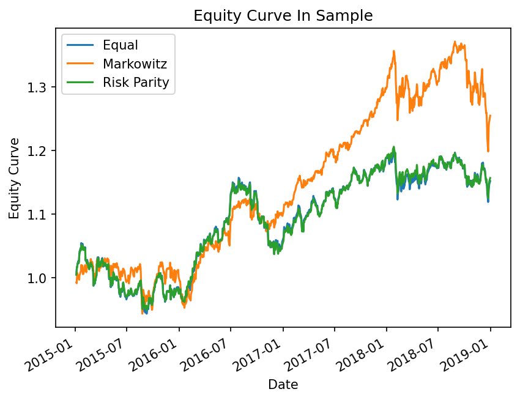
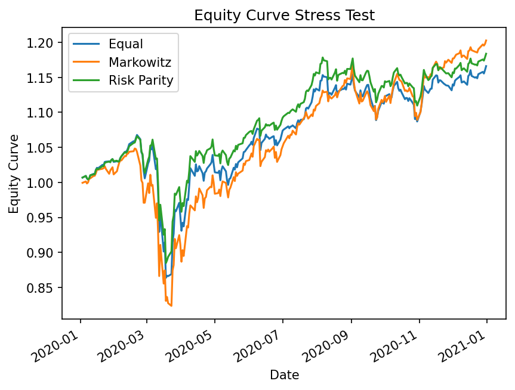
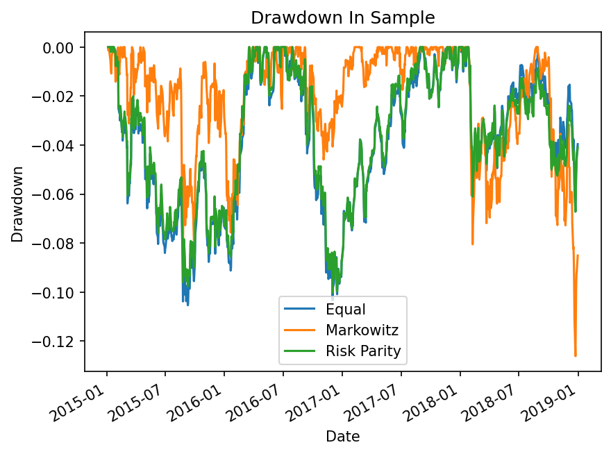
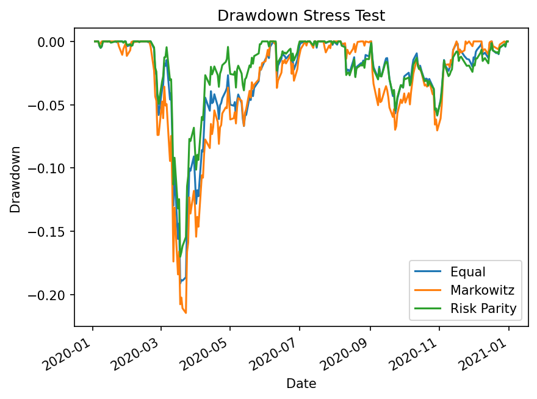

# What happens to portfolio optimization out of sample?

Three allocation methods estimated on 2015–2018, frozen, and tested through the 2020 crash.

## Key findings

**Markowitz and Risk Parity swap positions between the two periods:** Markowitz has the best Sharpe ratio in sample (0.459, against 0.237 for Equal Weight). Risk Parity has the best one out of sample (1.002, against 0.823).

**Compared to the naive Equal Weight portfolio, the advantage of optimization largely disappears:** Markowitz beats it by +94% in sample and by only +6% in 2020.

**The reason is risk concentration:** Markowitz holds 69% of the capital in SPY but 98.9% of the risk. When SPY fell in March 2020, almost nothing in the portfolio absorbed the loss, and Markowitz recorded the worst drawdown of the three: −21.4%, against −17.0% for Risk Parity.

## Portfolio weights and risk contributions

<table>
<tr>
<th>Capital weights</th>
<th>Risk contributions</th>
</tr>
<tr>
<td>

|     |   Equal |   Markowitz |   Risk Parity |
|:----|--------:|------------:|--------------:|
| SPY |   0.250 |       0.691 |         0.276 |
| GLD |   0.250 |       0.068 |         0.258 |
| TLT |   0.250 |       0.241 |         0.296 |
| VNQ |   0.250 |       0.000 |         0.170 |

</td>
<td>

|     |   Equal |   Markowitz |   Risk Parity |
|:----|--------:|------------:|--------------:|
| SPY |   0.233 |       0.989 |         0.250 |
| GLD |   0.206 |       0.006 |         0.250 |
| TLT |   0.171 |       0.005 |         0.250 |
| VNQ |   0.390 |       0.000 |         0.250 |

</td>
</tr>
</table>

Markowitz excludes VNQ entirely; Risk Parity keeps all four assets but underweights it.

Capital weights and risk weights are not the same thing. Under Equal Weight, VNQ holds 25% of the capital but carries 39% of the risk: it is the most volatile of the four and it is 0.58 correlated with SPY. Risk Parity balances the right-hand column by construction.

Markowitz is the extreme case: 69% of the capital in SPY, but 98.9% of the risk. TLT and GLD are each negatively correlated with SPY (−0.33 and −0.15), but their marginal contribution to portfolio risk is close to zero. In risk terms that portfolio is a single bet on SPY.

## Results

All figures are in decimals (0.038 = 3.8%). Return and volatility are annualized; VaR and CVaR are daily.

<table>
<tr>
<th>In Sample (2015–2018)</th>
<th>Out of Sample (2020)</th>
</tr>
<tr>
<td>

|                |   Equal |   Markowitz |   Risk Parity |
|:---------------|--------:|------------:|--------------:|
| Return         |   0.038 |       0.061 |         0.039 |
| Volatility     |   0.078 |       0.089 |         0.074 |
| Sharpe         |   0.237 |       0.459 |         0.260 |
| VaR 95% daily  |  -0.008 |      -0.009 |        -0.007 |
| CVaR 95% daily |  -0.012 |      -0.014 |        -0.011 |
| Max DD         |  -0.105 |      -0.126 |        -0.100 |

</td>
<td>

|                |   Equal |   Markowitz |   Risk Parity |
|:---------------|--------:|------------:|--------------:|
| Return         |   0.171 |       0.208 |         0.182 |
| Volatility     |   0.183 |       0.214 |         0.162 |
| Sharpe         |   0.823 |       0.876 |         1.002 |
| VaR 95% daily  |  -0.016 |      -0.018 |        -0.015 |
| CVaR 95% daily |  -0.031 |      -0.036 |        -0.028 |
| Max DD         |  -0.191 |      -0.214 |        -0.170 |

</td>
</tr>
</table>

<table>
<tr>
<th>In Sample (2015–2018)</th>
<th>Out of Sample (2020)</th>
</tr>
<tr>
<td>



</td>
<td>



</td>
</tr>
<tr>
<td>



</td>
<td>



</td>
</tr>
</table>

*Left: the estimation window, where Markowitz steadily pulls ahead. Right: 2020, where the three converge and Markowitz's trough is the deepest.*

## Method

Four ETFs are used as the investment universe: **SPY** (US equities), **TLT** (long-term Treasuries), **GLD** (gold) and **VNQ** (real estate). They were chosen because they cover different asset classes and do not move together: SPY and VNQ are 0.58 correlated, while TLT is −0.33 correlated with SPY.

Expected returns and the covariance matrix are estimated on daily data from 2015-01-02 to 2018-12-31 (1006 trading days). Three sets of weights are computed on that window:

- **Equal Weight** — 25% each, no optimization. The naive benchmark.
- **Markowitz** — weights that maximize the Sharpe ratio.
- **Risk Parity** — weights for which every asset contributes the same share of portfolio volatility.

The weights are then **frozen** and applied, without re-optimization, to 2020 daily returns (253 trading days). Every metric is computed the same way on both periods, from the realized portfolio return series.

## Assumptions

- **Constant-weight portfolios, rebalanced daily.** Portfolio returns are the weighted average of asset returns on each day, which implies the weights are restored every day.
- **Prices adjusted for dividends and splits** (`auto_adjust=True`), so returns are total returns. This matters here: TLT distributes monthly, GLD distributes nothing.
- **Risk-free rate fixed at 2% per year** on both periods.

## Limitations

- **One year of out-of-sample data.** 2020 is a single sample, and an unusual one. The result holds for this period; it is not a general claim about optimization.
- **The risk-free rate is held constant.** In 2020 the actual short-term rate was close to zero, so the 2020 Sharpe ratios are conservative. The bias is identical for all three portfolios, so the ranking is unaffected.
- **Correlations are not stable.** The covariance matrix is estimated on four calm years. In a crisis correlations tend to converge, so the hedges are weakest exactly when they are needed — part of the March 2020 drawdown comes from this.

## How to run

```
pip install -r requirements.txt
python code/main.py
```